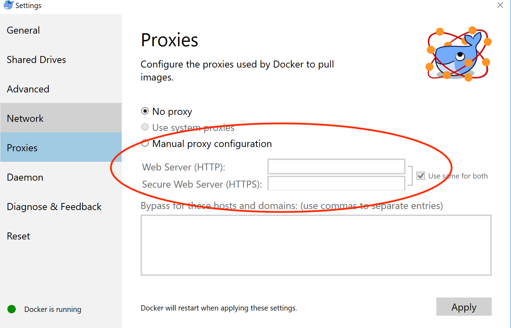

author: Geir André Lund
summary: Kafka-clients introduction codelab.
id: kafka-clients-intro
categories: kafka,java,event-driven
environments: Java
status: draft
feedback link:
analytics account: 0

# Kafka-clients introduction

## Overview of the tutorial

This tutorial shows you how to create a Kafka-consumer and -producer using [kafka-clients](http://kafka.apache.org/documentation/#api) java library.

What you'll learn
* How to create a Kafka producer that produce data from a Kafka-broker
* How to create a Kafka consumer that reads data from a Kafka-broker

Positive
: This tutorial requires that you are familiar with Java programming language.

### Prerequisites
Duration: 10:00

* Internet connectivity
* Java SKD installed - see [https://www.oracle.com/technetwork/java/javase/downloads/index.html](https://www.oracle.com/technetwork/java/javase/downloads/index.html) for instructions.
* Docker - see [https://www.docker.com/get-started](https://www.docker.com/get-started) for instructions.
* IntelliJ IDEA installed. Choose the Community version from the download link [IntelliJ Idea](https://www.jetbrains.com/idea/download)
* Optional: Git installed - see [https://git-scm.com/](https://git-scm.com/) for instructions.


## Set up
Duration: 5:00

### Java and project setup

[Download project](https://github.com/navikt/codelab-kafka-clients/archive/master.zip)

Extract the project to a directory. An alternative, use git to clone the project. 
(On NAV developer image you will need add proxy by running ```git config --global http.proxy http://webproxy-utvikler.nav.no:8088``` first)
``` bash
git clone https://github.com/navikt/codelab-kafka-clients.git
```

In project root, run gradle:

``` bash
$ cd codelab-kafka-clients
$ ./gradlew --offline build
```

or in Windows:

``` bash
$ cd codelab-kafka-clients
$ gradlew.bat --offline build
```

If everything is set up you should see

``` bash
BUILD SUCCESSFUL in Xs
```

Negative
: On NAV developer image: If you get an `Connection refused` error when executing gradle.

Add a file named `gradle.properties` in an folder named `.gradle` in your home directory with the following content:

```@bash
systemProp.proxySet=true
systemProp.http.proxyHost=webproxy-utvikler.nav.no
systemProp.http.proxyPort=8088
systemProp.https.proxyHost=webproxy-utvikler.nav.no
systemProp.https.proxyPort=8088
```

Windows: `C:\Users\<username>\.gradle\gradle.properties`
Linux and Mac: `~/.gradle/gradle.properties`


### Docker

In the project directory, there is a `docker-compose.yml` file, navigate to the file and run docker-compose:

``` bash
$ docker-compose up
```

This should start Zookeeper and a Kafka instance locally.

#### Docker "connection refused" 

On NAV developer image you will need to configure proxy for docker. Open Docker and Settings:

* Tick "Manual proxy configuration"
* Use `http://webproxy-utvikler.nav.no:8088` on both HTTP and HTTPS field



### IntelliJ 

* Open the project in IntelliJ by choosing: `File -> New -> Project from Existing sources...` navigate to project folder and press OK
* Choose `Gradle` in next window - Next
* Underneath `Global Gradle settings` - choose `Offline work` and hit `Finish`

## Fizz-buzz game with Kafka
Duration: 3:00

1. Create a consumer that consume the `FizzBuzzNumberEntered` topic (See FizzBuzzCandidateProducer.java in the project).
2. Based on the number in `FizzBuzzNumberEntered`, calculate whether or not that number is a ["Fizz-Buzz" number](https://en.wikipedia.org/wiki/Fizz_buzz) candidate and
3. produce a message to Kafka with topic `FizzBuzzAnswered` with the answer.

The answer must be compliant to JSON file:

```json
{
  "answer": "FizzBuzz", // - "FizzBuzz", "Fizz" or "Buzz"
  "candidate" : 15, // Number entered
  "groupId" : "A-team" // Identicator of the team
}
```


• Fizz-Buzz test - Write a program that prints the numbers from 1 to 100. But for multiples of three print “Fizz” instead of the number and for the multiples of five print “Buzz”. For numbers which are multiples of both three and five print “FizzBuzz"
Ref [https://en.wikipedia.org/wiki/Fizz_buzz](https://en.wikipedia.org/wiki/Fizz_buzz)

## The FizzBuzzNumberEntered topic producer
Duration: 10:00

Provided in the project there is a Java class named `FizzBuzzCandidateProducer`. This class produce random numbers on a topic named `FizzBuzzNumberEntered`.


## Create an FizzBuzzNumberEntered topic consumer
Duration: 10:00

* In IntelliJ - Create a new Java file, give it a name (e.g. `FizzBuzzNumberEnteredConsumer.java`)
* We need to declare a `KafkaConsumer` and instantiate it;

```@java
public class FizzBuzzNumberEnteredConsumer {

    private final static String TOPIC = "FizzBuzzNumberEntered";
    private final static String BOOTSTRAP_SERVERS = "localhost:9092";

    public static void main(String[] args) {
        Properties consumerProperties = new Properties();
        consumerProperties.put(ConsumerConfig.BOOTSTRAP_SERVERS_CONFIG, BOOTSTRAP_SERVERS);
        consumerProperties.put(ConsumerConfig.GROUP_ID_CONFIG, "fizzbuzz-consumer");
        consumerProperties.put(ConsumerConfig.KEY_DESERIALIZER_CLASS_CONFIG, StringDeserializer.class);
        consumerProperties.put(ConsumerConfig.VALUE_DESERIALIZER_CLASS_CONFIG, IntegerDeserializer.class);


        KafkaConsumer<String, Integer> consumer = new KafkaConsumer<>(consumerProperties);
        consumer.subscribe(Collections.singleton(TOPIC));

    }
}

```

* The above code is enough to configure a Kafka-consumer against a broker.  But in order to consume messages we need a few more lines of code:

```@java
      while (true) {
          ConsumerRecords<String, Integer> records = consumer.poll(Duration.ofMillis(100)); // Fetch records, give up after timeout
          for (ConsumerRecord<String, Integer> record : records) {
              System.out.println("Consumed " + record);
          }
      }
```

* We should now be able to consume records from Kafka. Try it out by first start the consumer we just created (Run the main method in IntelliJ) and then start the producer, `FizzBuzzCandidateProducer` (Run the main method in IntelliJ). If all looks good, go ahead to the next section.

## Calculate FizzBuzz and produce the answer to kafka
Duration: 30:00

Provided in the project there is an FizzBuzz "calculator" we can use to calculate the answer. 

```@java
      while (true) {
          ConsumerRecords<String, Integer> records = consumer.poll(Duration.ofMillis(100)); // Fetch records, give up after timeout
          for (ConsumerRecord<String, Integer> record : records) {
              System.out.println("Consumed " + record);
              // first extract the number from the record
              Integer number = record.value();
              // Calculate FizzBuzz
              String fizzBuzzCandidate = FizzBuzz.calculate(number);
              FizzBuzzAnswerMessage answer = new FizzBuzzAnswerMessage(fizzBuzzCandidate, number, "A-Team");
              
              // create json 
              final String answerAsJson = new Gson().newBuilder().create().toJson(answer);
              
              // @todo: Produce answer to `FizzBuzzAnswered` topic
              
              // tip: See FizzBuzzCandidateProducer.java 
              
          }
      }
```


Tip, Kafka also has a command line consumer that will dump out messages to standard output, by running:  

`docker run --net host confluentinc/cp-kafka kafka-console-consumer --bootstrap-server localhost:9092 -topic FizzBuzzAnswered`


