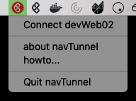

author: Team Aura
id: nais-getting-started
summary: Dette kurset hjelper deg med å komme i gang med NAIS-plattformen
status: draft
feedback link:

# NAIS tutorial

## Om kurset
Dette kurset hjelper deg med å komme i gang med å bruke NAIS-plattformen. Du vil lære om de forskjellige featurene NAIS-plattformen tilbyr, hvordan man deployer, og litt hvordan Kubernetes henger sammen.

### Hva er NAIS
[NAIS](https://nais.io) er NAV sin applikasjonsplattform, bygd for å gi høyere utviklingsfart ved å tilby utviklere i NAV de beste verktøyene for å utvikle og kjøre sine applikasjoner. Selve NAIS-plattformen er basert på [Kubernetes](https://kubernetes.io/), med en rekke andre rammeverk og verktøy for å støtte under hva våre utviklere trenger.


## Prerequisites
Duration: 20:00

Følgende må fungere for å kunne gjennomføre denne workshopen.
* Github
* ScaleFT og NAVTunnel
* Kubeconfig
* Kubectl

### Github
Gå til [myapps.microsoft.com](https://myapps.microsoft.com/) og trykk på appen **Github.com**.


### ScaleFT og NAVTunnel
For å kunne nå NAIS-plattformen så må du ha ScaleFT og [NAVTunnel](https://github.com/navikt/mob_2.0_navTunnel#navtunnel-scaleft-aka-okta-advanced-server-access) installert.

**Mac**
På Mac skal begge disse verktøyene var installert automatisk på ny maskin.

**Windows**
Følg oppskriften i [https://github.com/navikt/mob_2.0_navTunnel#for-windows](https://github.com/navikt/mob_2.0_navTunnel#for-windows) repoet.

### Kubeconfig
Kubeconfig er konfigurasjonen som bestemmer hva du kan nå på NAIS-plattformen, og brukes sammen med kubectl. Hent ned NAV sin konfig fra [navikt/kubeconfigs](https://github.com/navikt/kubeconfigs).

Vi anbefaler at du enten legger konfigurasjonen i katalogen `$HOME/.kube/` som er standard oppsettet til **kubectl**. Eller så kan du bestemme selv ved å sette miljøvariabelen `KUBECONFIG`.

### Kubectl
Kubectl er verktøyet vi bruker for å kommunisere med Kubernetes og NAIS-plattformen. Følg oppskriften [Install and Set Up kubectl](https://kubernetes.io/docs/tasks/tools/install-kubectl/) for å sette opp kubectl på din egen maskin.

Du kan verifisere at kubectl er installert på din maskin ved å kjøre kommandoen `kubectl version`. Da skal responsen være noe lignende som nedenfor. Du vil ikke ha kontakt med NAIS på dette stadiet.

```bash
$ kubectl version
Client Version: version.Info{Major:"1", Minor:"14", GitVersion:"v1.14.3", GitCommit:"5e53fd6bc17c0dec8434817e69b04a25d8ae0ff0", GitTreeState:"clean", BuildDate:"2019-06-07T09:55:27Z", GoVersion:"go1.12.5", Compiler:"gc", Platform:"darwin/amd64"}
The connection to the server localhost:8080 was refused - did you specify the right host or port?
```

Ønsker du å lære mer om kubectl kan du ta en titt på den [offisielle dokumentasjonen](https://kubectl.docs.kubernetes.io/).


## Tilgang
Duration: 3:00

Nå som alle verktøy forhåpentligvis er installert riktig, så må vi koble oss opp til NAIS. Dette gjøres via ScaleFT/NAVTunnel og autentisering mot AD.

#### Logg inn via ScaleFT eller NAVTunnel
Hver gang du skal kommunisere med NAIS må du være logget inn via ScaleFT/NAVTunnel og koblet på `devWeb02`. 

**Mac**
For å forenkle prossessen anbefaler vi at dere bruker NAVTunnelen til å både innlogging og for å koble seg på. Start ved å trykke på NAVTunnel ikonet i *menu bar*. Den vil da automatisk åpne opp en nettleser hvor du så kan logge deg inn. Etter dette trykker du på `Connect devWeb02` via NAVTunnelen.


**Windows**
Kjør `ssh -fNq devWeb02` for å sette opp tunnellen. Hvis dette feiler, kan det være at ScaleFT-sesjonen er gått ut. Kjør da `ƒsft login` og prøv på nytt.

#### Context og kubectl
Neste steg går ut på å velge context vi ønsker å kommunisere mot, og autentisere oss mot NAIS.

Kjør følgende kommando for å sette context (i denne workshopen bruker vi **dev-fss**):

For å autentisere oss, må vi begynne å snakke med NAIS, og første gangen vil vi bli bedt om å logge inn med NAV-e-post og passord. Når dette er gjort vil kubectl oppdatere kubeconfig-filen vår med nødvedige tokens for å kommuniserer ned NAIS.
```
$ kubectl get pods
To sign in, use a web browser to open the page https://microsoft.com/devicelogin and enter the code DWQ7L3D9K to authenticate.
```

Hvis alt går som det skal, så vil du etter innloggingen får en liste av pods som kjører i *dev-fss*

### Context + namespace = miljø
Som den gamle applikasjons-plattformen, har ikke NAIS-plattforen bare et miljø. Den store forskjellen er at et miljø på NAIS består av to deler. Først har vi **context** (også kalt cluster på folkemunn), som er tilpasset sone-modellen i NAV, så har vi **namespace**, som er en oppdeling av en **context**, altså et avgrenset område innad i context. Derfor blir context pluss namespace miljøet du er i. For de fleste anbefaler vi å bruke *default* namespace.

For eksempel vil en applikasjon kjøre i context **prod-fss**, og namespace **default**, miljøet til applikasjonen vil da være **prod-fss:default**.

### Teamtilgang
Da NAIS er en delt plattform, skiller vi mellom rettigheter/tilganger innad på team du hører til. Derfor må alle ressurser som skal opprettes knyttes til et team via noe som heter `labels`. For å gjøre det enkelt for deg med denne workshopen kan du bruke felles teamet `naiscodelabs`, som du kan få tilgang til via [Add apps](https://account.activedirectory.windowsazure.com/r#/addApplications) på [myapps.microsoft.com](https://myapps.microsoft.com).


## Docker
Duration 10:00

TODO: Skulle vi hatt en egen del om Docker?

For å kjøre applikasjoner på NAIS bruker vi Docker. Docker er en containerteknologi hvor vi kan pakke applikasjonen vår og dens avhengigheter inn i et image. Når dette imaget startes, lages det en container hvor applikasjonen kjører etter spesifikasjonene vi har definert da vi lagde imaget.


### Bygg image

### Test image

### Push til hub.docker.com/Github
Mange steder å lagre docker-images


## NAIS
Duration: 5:00

Fortelle mer om hva en NAIS-app er for noe?

### Manifestet - nais.yaml
Write file: `app.yaml` with contents:
```
apiVersion: nais.io/v1alpha1
kind: Application
metadata:
  name: <YOUR_APP>
  labels:
    team: workshop
spec:
  image: gcr.io/google-containers/echoserver:1.10
  port: 8080
  liveness:
    path: /
  readiness:
    path: /
  env:
    - name: ENV_NAME
      value: "value"
  ingresses: 
    - "https://<YOUR_APP>.127.0.0.1.xip.io"
```

### Manuell deploy
```
kubectl apply -f app.yaml
```


#### Genererte ressurser
Take a look at the resources that gets created:

```
kubectl get all -l app=YOUR_APP
```

This command will output all recources that is labeled by `app=YOUR_APP`. You might need to run this a couple of times to see everthing.

### Visit your app

#### Lokalt med port-forward

Run a new curl to see that your app is running:

```bash
curl http://<YOUR_APP>.127.0.0.1.xip.iox
```

#### Via ingress og VDI

### Naiserator

Check out the file [naiserator-max.yaml](https://github.com/nais/naiserator/blob/master/examples/nais-max.yaml) to see all features and possibilities provided by naiserator.

## Opprydding
Duration 1:00

You can delete your app by running:

```
kubectl delete application YOUR_APP
```

## Further reading

Check out the NAIS documentation at [https://nais.io/doc](https://nais.io/doc).
